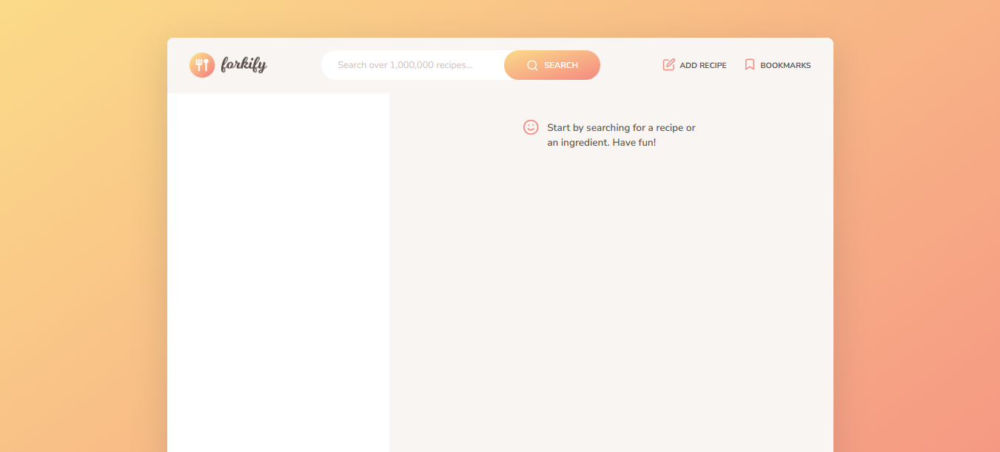
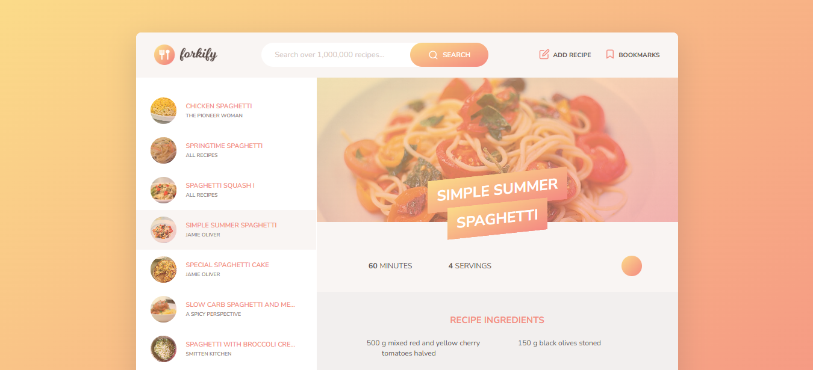

# Forkify — Recipe Application

A modern recipe discovery web application built with **JavaScript**, allowing users to search for recipes, view detailed cooking instructions, adjust serving sizes, and bookmark their favorite recipes.

## Live Demo

**Live Website:** `https://forkify-kitchen.netlify.app`

## Features

- Search recipes by keywords
- View detailed recipe information
- Display ingredients and cooking instructions
- Adjust recipe servings dynamically
- Bookmark favorite recipes
- View bookmarked recipes
- Dynamic UI updates without page reloads
- Fetch recipe data using a REST API
- Handle asynchronous operations with `async/await`
- Responsive and user-friendly interface

## Technologies Used

- **HTML5** — Semantic page structure
- **CSS3 / Sass** — Styling and responsive layout
- **JavaScript (ES6+)** — Application logic and interactivity
- **REST API** — Recipe data retrieval
- **Parcel** — Module bundling and development workflow
- **NPM** — Package management
- **Git & GitHub** — Version control
- **Netlify** — Deployment

## JavaScript Concepts Practiced

This project demonstrates practical use of:

- ES6 Modules
- Classes and Object-Oriented Programming
- Asynchronous JavaScript
- `async/await`
- Promises
- `fetch()` API
- Event handling
- DOM manipulation
- Dynamic rendering
- Publisher-Subscriber pattern
- API error handling
- State management
- Local storage / bookmarking

## API

The application retrieves recipe information through a REST API and processes the returned data using asynchronous JavaScript.

> **Note:** If your API requires an API key, create your own key and configure it according to the project's API setup.

## Project Preview

## Project Goals

The main goal of this project was to build a practical JavaScript application while strengthening skills in **API integration, asynchronous programming, modular architecture, DOM manipulation, state management, and modern JavaScript development workflows**.

## Author

**Abdul Muqeet**

Computer Science Student | Aspiring Software Engineer

- GitHub: `https://github.com/Abdul-Muqeet-Niazi`
- LinkedIn: `https://www.linkedin.com/in/abdul-muqeet-niazi`

## License

This project is intended for **educational and portfolio purposes**.
